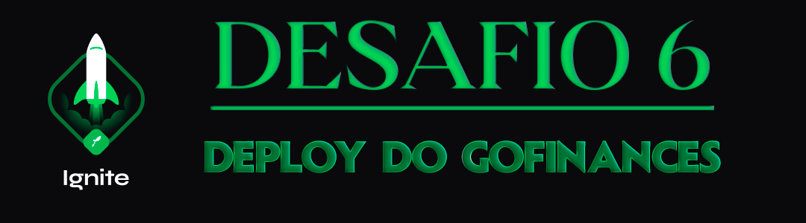

<div align="center">
  
</div>

<h1 align="center"> RocketSeat 🚀 Ignite React Native 📱</h1>

<p align="center">
  <a href="https://rocketseat.com.br">
    
  </a>
  
  
  
</p>

## 🧠 Detalhes do desafio

Nesse desafio, você deverá fazer o deploy de uma das aplicações mais legais que vimos em toda a trilha do Ignite, o GoFinances. 

Esse desafio tem o objetivo que você pratique o tópico de publicação de aplicações Mobile com uma aplicação real.

## ⚙️ Instalação do projeto

## Clone este repositório e acesse o diretório

```sh
$ git clone git@github.com:augustohermes/desafio05-github-explorer.git && cd desafio05-github-explorer
```

## Instale as dependências necessárias

```sh
$ yarn
```

## Rodando o projeto

```sh
$ yarn start
```

## Abra outro terminal e inicie o projeto no emulador

```ssh
$ npx react-native run-android
```

<br>

Feito com ❤️ por [Augusto Hermes](https://github.com/augustohermes) 👋.
